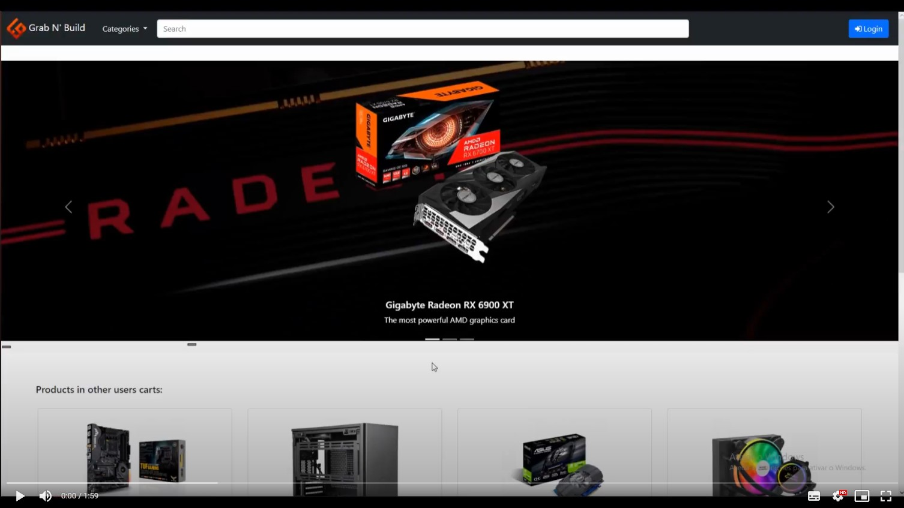

# PA: Product and Presentation

Grab n' Build is a project devolopped for the course unit of Database and Web Applications Laboratory at the Engineering Faculty of University of Porto.

## A9: Product

Grab n' Build is an online store that aims to serve the growing market of computer parts, users will find a wide variety of products that they can choose from and buy.

### 1. Installation

The final code for our web application can be cloned from [here](https://git.fe.up.pt/lbaw/lbaw2122/lbaw2175/-/tree/PA). After cloning the repository you can run the image by posting this command on the command line:

`docker run -it -p 8000:80 -e DB_DATABASE="lbaw2175" -e DB_USERNAME="lbaw2175" -e DB_PASSWORD="zvHpsCmg"` 

### 2. Usage

URL to the product: http://lbaw2175.lbaw.fe.up.pt  

#### 2.1. Administration Credentials

| Email | Password |
| -------- | -------- |
| up201907716    | password |

#### 2.2. User Credentials

| Type          | Email  | Password |
| ------------- | --------- | -------- |
| Normal User | vova10000@bukan.es    | firstUserPass |


### 3. Application Help

#### 3.1 Forms placeholders

Each form had its inputs fields filled with placeholders to better guide the user around correct input. Here are some examples: 

#### 3.1.1 Add product form

```html
  <div class="col-md-8">
    <label for="name" class="form-label">
      <span>Product Name</span> 
      <small class = "required-input">*</small>
    </label>
    <input type="text" class="form-control" name="name" id="name" placeholder="Latest generation processor" required>
  </div>

  <div class="col-md-4">
    <label for="price" class="form-label">
      <span>Price</span> 
      <small class = "required-input">*</small>
    </label>
    <input type="text" class="form-control" name="price" id="price" placeholder="123.00" required>
  </div>    

  <div class="col-md-4">
    <label for="size" class="form-label">
      <span>Size</span> 
    </label>
    <input type="text" class="form-control" name="size" id="size" placeholder = "WWxLLxAA">
  </div>

  ...
```

#### 3.1.2 Login Page

```html
<div class="form-group d-flex flex-column mt-3">
  <label for="email">
    <h6>Email</h6>
  </label>
  <input class = "form-control" type = "email" id="email" name="email" value = "{{old('email')}}" required autofocus>
  @if ($errors->has('email'))
    <span class="error">
      {{ $errors->first('email') }}
    </span>
  @endif
</div>
                
<div class="form-group d-flex flex-column mt-3" id="pwd">
    <label for="password">
        <h6>Password</h6>
    </label>
    <input class = "form-control" id="password" type="paname="password" required>
    <span title="Show password">
        <i class="bi bi-eye-slash" id="togglePassword"></i>
    </span> 
    @if ($errors->has('password'))
        <span class="error">
            {{ $errors->first('password') }}
        </span>
    @endif
</div>                   
```

#### 3.2 Admin input table

Because of the way we developed our database, inputing the details of a product can be a little deceiving for admins. So when pulling out the "Add Product Form", a table with the inputs type pops up as well:

```html
<table class="tg">
  <thead>
    <tr>
      <th class="tg-ev0v">Category</th>
      <th class="tg-ev0v">CPU</th>
      <th class="tg-ev0v">GPU</th>
      <th class="tg-ev0v">Motherboard</th>
      <th class="tg-ev0v">Storage</th>
      <th class="tg-ev0v">PcCase</th>
      <th class="tg-ev0v">Cooler</th>
      <th class="tg-ev0v">PowerSupply</th>
      <th class="tg-ev0v">Other</th>
    </tr>
  </thead>
  <tbody>
      <tr>
        <td class="tg-ev0v">Field 1</td>
        <td class="tg-0pky">baseFreq{float}</td>
        <td class="tg-0pky">memory{number}</td>
        <td class="tg-0pky">chipset{text}</td>
        <td class="tg-0pky">type{text}</td>
        <td class="tg-0pky">type{text}</td>
        <td class="tg-0pky">type{text}</td>
        <td class="tg-0pky">wattage{number}</td>
        <td class="tg-0pky"></td>
      </tr>
      <tr>
        <td class="tg-ev0v">Field 2</td>
        <td class="tg-0pky">turboFreq{float}</td>
        <td class="tg-0pky">coreClock{number}</td>
        <td class="tg-0pky">type{text}</td>
        <td class="tg-0pky">capacity{number}</td>
        <td class="tg-0pky">weight{text}</td>
        <td class="tg-0pky"></td>
        <td class="tg-0pky">certification{text}</td>
        <td class="tg-0pky"></td>
      </tr>
      <tr>
        <td class="tg-ev0v">Field3</td>
        <td class="tg-0pky">socket{text}</td>
        <td class="tg-0pky">boostClock{number}</td>
        <td class="tg-0pky"></td>
        <td class="tg-0pky"></td>
        <td class="tg-0pky">color{text}</td>
        <td class="tg-0pky"></td>
        <td class="tg-0pky">type{text}</td>
        <td class="tg-0pky"></td>
      </tr>
      <tr>
        <td class="tg-ev0v">Field4</td>
        <td class="tg-0pky">threads{number}</td>
        <td class="tg-0pky">hdmiPorts{number}</td>
        <td class="tg-0pky"></td>
        <td class="tg-0pky"></td>
        <td class="tg-0pky"></td>
        <td class="tg-0pky"></td>
        <td class="tg-0pky"></td>
        <td class="tg-0pky"></td>
      </tr>
      <tr>
        <td class="tg-ev0v">Field5</td>
        <td class="tg-0pky">cores{number}</td>
        <td class="tg-0pky">displayPorts{number}</td>
        <td class="tg-0pky"></td>
        <td class="tg-0pky"></td>
        <td class="tg-0pky"></td>
        <td class="tg-0pky"></td>
        <td class="tg-0pky"></td>
        <td class="tg-0pky"></td>
      </tr>
  </tbody>    
</table>  
```


### 4. Input Validation

For input validation, both Client and Server-side validation were used.

#### 4.1 Client-Side Validation

Regarding Client-Side validation, we used Blade validation in HTML forms:

##### 4.1.1 Login Form

```html
  <div class="form-group d-flex flex-column mt-3">
    <label for="email">
      <h6>Email</h6>
    </label>
    <input class = "form-control" type = "email" id="email" name="email" value = "{{old('email')}}" required autofocus>
    @if ($errors->has('email'))
      <span class="error">
        {{ $errors->first('email') }}
      </span>
    @endif
  </div>
```
#### 4.1 Server-Side Validation

On the Server side, we made use of a validator in the Register Controller to verify if the user really inputed the requested data:

```php
  return Validator::make($data, [
    'name' => 'required|string|min:8|max:255',
    'email' => 'required|string|email|max:255|unique:User',
    'password' => 'required|string|min:8|confirmed',
    'phone' => 'integer',
    'profilePic' => 'image',
  ]);
```

On other forms, we took advantage of built-in PHP functions to parse different types of inputs. For instance, when submitting an address to the server, the __Address Controller add()__ method uses a REGEX to fit the input in a right zipcode assembly:  

```php
  $regex = '/^[0-9]{4}-[0-9]{3}$/';
  if(!preg_match($regex, $zipcodeNumber)){
    array_push($errors, 'Zipcode does not match the specified format.');
  }  
```

This parsing is made for other inputs as well, regardless of their types. After the validation fails, the user is redirected to the form page, where details about the error are displayed.

### 5. Accessibility and Usability

Accessibility: [Link](docs/Acessibility.pdf)  
Usability: [Link](docs/Usability.pdf)  

### 6. HTML & CSS Validation

HTML:
- [About Page](docs/HTML/about.pdf)  
- [Cart Page](docs/HTML/cart.pdf)  
- [Contacts Page](docs/HTML/contacts.pdf)  
- [FAQ Page](docs/HTML/faq.pdf)  
- [Home Page](docs/HTML/home.pdf)  
- [Login Page](docs/HTML/login.pdf)  
- [Products list Page](docs/HTML/product_list.pdf)  
- [Product Page](docs/HTML/product.pdf)  
- [Recover Password Page](docs/HTML/recover_password.pdf)  
- [Register Page](docs/HTML/register.pdf)  
- [User Profile Page](docs/HTML/user_profile.pdf)  

CSS: 
- [About File](docs/CSS/about.pdf)  
- [App File](docs/CSS/app.pdf)  
- [Buttons File](docs/CSS/buttons.pdf)  
- [Cart File](docs/CSS/cart.pdf)  
- [Contacts File](docs/CSS/contacts.pdf)  
- [FAQ File](docs/CSS/faq.pdf)  
- [Login/Register File](docs/CSS/login_register.pdf)  
- [Not Found File](docs/CSS/not_found.pdf)  
- [Product Form File](docs/CSS/product_form.pdf)  

### 7. Revisions to the Project

Since the requirements specification stage, we have made a few changes to our project. 
Here are some of them:
- Guests cannot add items to their cart, if they want to, they need to either log in or register in the website.
- We have added some pages
  - Cart page;
  - Recover password page;  
- An admin cannot consult a user's purhcase history and has only an overall view of all the orders in the website.
- An admin cannot edit any of the static pages.
- If a user deletes their account, their orders dissapear from the database due to an oversight when building the database. However, that does not happen with their reviews, as they're kept in the database, only changing the writer to `null`.

### 8. Implementation Details

#### 8.1. Libraries Used

No libraries were used in this project.

#### 8.2 User Stories

| US Identifier | Name    | Module | Priority                       | Team Members               | State  |
| ------------- | ------- | ------ | ------------------------------ | -------------------------- | ------ |
|US01|Home|M02|High|Carlos Verissimo, Nuno Jesus|95%|
|US02|FAQ|M05|High|Carlos Verissimo|100%|
|US03|Contacts|M05|High|Carlos Verissimo|100%|
|US04|About|M05|High|Carlos Verissimo|80%|
|US05|Search using the Navigation Menu|M02| High|Nuno Jesus|100%|
|US06|Searching using the Search Bar|M02| High|Carlos Verissimo, Nuno Jesus|70%|
|US07|Filter search results|M02|High|Carlos Verissimo, Nuno Jesus|100%|
|US08|Sort search results|M02|High|Carlos Verissimo|100%|
|US09|Access product page|M02|High|Nuno Jesus|100%|
|US11|Manage Cart|M04| High|Nuno Jesus|90%|
|US21|Manage products|M02|High|Nuno Jesus|90%|
|US22|Edit a product|M02|High|Nuno Jesus|100%|
|US24|Edit Products Categories|M02|High||0%|
|US25|Delete Users|M01|High|Nuno Jesus|100%|
|US26|Unblock User|M05|High|Carlos Verissimo, Nuno Jesus|100%|
|US27|Block User|M05|High|Carlos Verissimo, Nuno Jesus|100%|
|US28|Check a user purchase history|M05|High||0%|
|US29|Manage Order Status|M04|High|Nuno Jesus|100%|
|US31|Profile|M01|High|Nuno Jesus|80%|
|US32|Check Notifications|M01|High|Nuno Jesus|100%|
|US33|Check-out|M04|High|Duarte Sardão, Tomás Torres|100%|
|US34|Payment|M04|High|Duarte Sardão, Tomás Torres|50%|
|US35|Delete Account|M01|High|Nuno Jesus|100%|
|US36|Report Reviews|M03|High|Carlos Verissimo|100%|
|US37|Sign-out|M01|High|Nuno Jesus|100%|
|US38|Check Purchase History|M04|High|Nuno Jesus|100%|
|US39|Vote on a Review|M03|Medium|Carlos Verissimo|100%|
|US310|Wishlist|M03|Low|Nuno Jesus|100%|
|US41|Sign-In|M01|High|Nuno Jesus|100%|
|US42|Sign-Up|M01|High|Nuno Jesus|100%|
|US51|View Order|M04|High|Nuno Jesus|100%|
|US52|Track Order|M04|High|Nuno Jesus|100%|
|US53|Cancel Order|M04|High|Carlos Verissimo, Nuno Jesus|100%|
|US61|Post Review|M03|High|Carlos Verissimo|100%|
|US63|Delete review|M03|High|Carlos Verissimo|100%|

---


## A10: Presentation
 
### 1. Product presentation

Grab 'n Build is a store dedicated to the computer parts market. Users can navigate several categories through the navebar as well as search for products using the included search bar.
Filtering results is made easy, as users can filter out products by their stock, their rating or their price. Buyers can also sort the results by those same three parameters. Adding reviews is also easy, users only need to navigate to the product they want to evaluate, choose a rating and add a comment. Reporting and upvoting/downvoting reviews is also possible.

Users can add products to their carts and go through with a purchase, choosing a payment method and an address. Addresses are managed through the user profile. Users can also choose to keep the products in the cart or in a wishlist, since they recieve a notification when a product in any of those drops in price, or when a product that was once unavailable becomes avaliable again.

URL to the product: http://lbaw2175.lbaw.fe.up.pt  

URL to the slides used in the presentation: [Presentation](/docs/Presentation.pdf)


### 2. Video presentation

[Here's](https://drive.google.com/file/d/1UHsWo1DHUKdLptJDrUJAxX2QJ9_K4Cqc/view?usp=sharing "Videos folder") a video showcasing Grab N' Build:


---


## Revision history

Changes made to the first submission:
None.

***
GROUP2175, 28/01/2022

* Carlos Veríssimo, up201907716 
* Duarte Sardão, up201905497
* Nuno Jesus, up201905477 (Editor)
* Tomás Torres, up201800700 